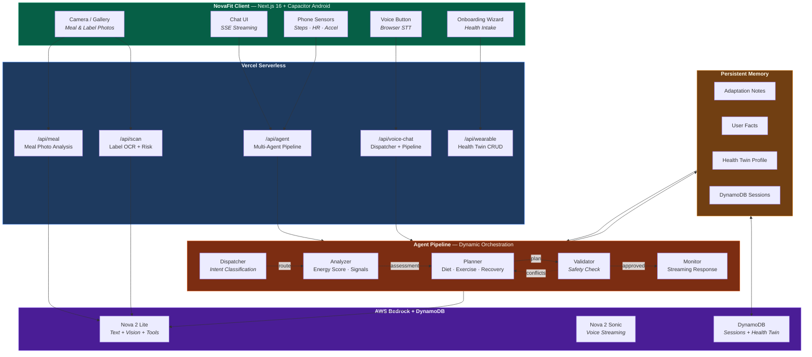
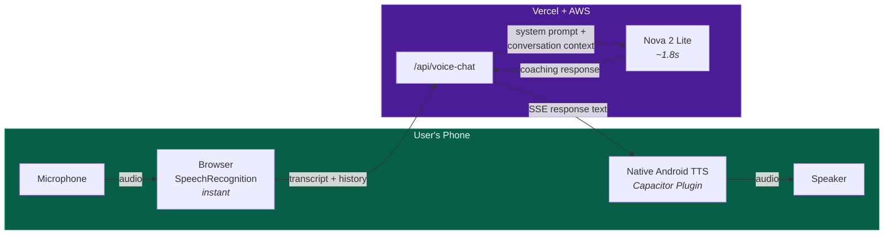
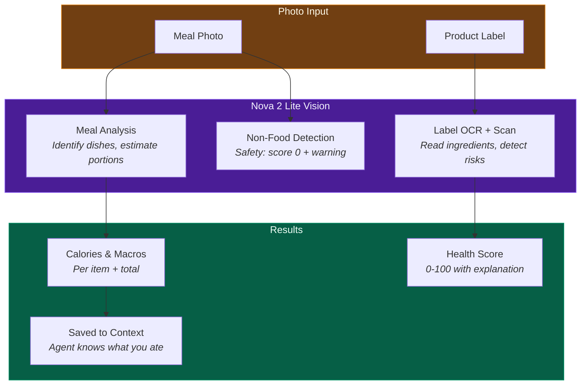

# NovaFit — Multi-Agent AI Wellness Coach

**Amazon Nova AI Hackathon 2026 Submission**

NovaFit is a 3-agent AI wellness coach that **sees your meals**, **hears your voice**, **reads your phone sensors**, and creates **personalized health plans** — powered entirely by Amazon Nova.

**Live demo**: [novafit-rho.vercel.app](https://novafit-rho.vercel.app)

---

## Architecture Overview



## Agent Pipeline

NovaFit uses a **5-agent dynamic pipeline** with intent-based routing and inter-agent verification:

```mermaid
sequenceDiagram
    participant U as User
    participant O as Orchestrator
    participant D as Dispatcher
    participant A as Analyzer Agent
    participant P as Planner Agent
    participant V as Validator Agent
    participant M as Monitor Agent
    participant B as Nova 2 Lite
    participant T as Tools
    participant DB as DynamoDB

    U->>O: Message + Sensor Data
    O->>DB: Load session (cold start recovery)

    rect rgb(75, 0, 130)
        Note over D: Stage 0 — Intent Classification
        O->>D: User message + history
        D->>D: Regex pre-filter (0ms)
        alt Ambiguous
            D->>B: Classify intent (~50 tokens)
        end
        D-->>O: Route: greeting|quick|followup|full|photo
    end

    alt greeting/quick route
        O->>M: Skip to Monitor (fast path)
        M-->>U: SSE Stream (~1s)
    else full/photo route

    rect rgb(6, 95, 70)
        Note over A: Stage 1 — Health Assessment
        O->>A: Message + wearable + image + history
        A->>B: Converse API (text or multimodal)
        B-->>A: Energy score, signals, risk flags
    end

    rect rgb(30, 58, 95)
        Note over P: Stage 2 — Plan Generation
        O->>P: Assessment + nutrition context
        P->>B: Converse API with toolConfig
        B-->>P: Tool call: get_health_data
        P->>T: Execute tool
        T-->>P: Live sensor data
        B-->>P: Diet, exercise, recovery plan
    end

    rect rgb(0, 100, 100)
        Note over V: Stage 3 — Safety Validation
        O->>V: Plan + Health Twin profile
        V->>V: Check allergies, dislikes, conditions
        alt Conflicts found
            V-->>P: Rejection + conflict details
            P->>B: Re-generate plan avoiding conflicts
        end
        V-->>O: Approved
    end

    rect rgb(124, 45, 18)
        Note over M: Stage 4 — Streaming Response
        O->>M: Assessment + validated plan + history
        M->>B: ConverseStream API (token streaming)
        B-->>M: Chunks → SSE to client
        M-->>U: Real-time typing effect
    end

    end

    O->>DB: Persist session + Health Twin updates
```



### What Makes This Agentic (Not Just Prompt Chaining)

- **Dynamic routing** — Dispatcher classifies intent and routes to minimum required agents (greeting = 1 agent, full = 5 agents). Saves cost and latency.
- **Inter-agent verification loop** — Validator checks Planner's output against Health Twin (allergies, dislikes, conditions). If conflicts found, Planner re-generates. Self-correcting pipeline.
- **Nova native tool calling** — Planner dynamically decides when to call `get_health_data`, `get_nutrition_info`, or `get_daily_progress` using Bedrock's `toolConfig`
- **Predictive coaching** — Monitor proactively references Health Twin patterns ("I notice you sleep poorly on workdays")
- **Token streaming** — Monitor uses `ConverseStreamCommand` for real-time typing effect
- **Persistent DynamoDB memory** — Sessions survive Vercel cold starts. Health Twin syncs server↔client.
- **Cross-modal continuity** — Voice and text share conversation history and Health Twin context
- **Observable reasoning** — Expandable panel shows dispatcher route, per-agent timing, validator status, and token estimates
- **Onboarding intake** — 3-screen wizard that immediately populates Health Twin for first-message personalization
- **Prompt injection defense** — Regex-based detection of injection patterns before pipeline execution
- **Graceful degradation** — Intelligent fallback with topic detection when Bedrock quota is exceeded
- **42 unit tests** — Vitest coverage for dispatcher, validator, prompt guard, Health Twin, and JSON utilities

## Voice Architecture

NovaFit uses a hybrid voice pipeline optimized for speed (~2s total latency):



**Key design decisions:**
- Browser STT is instant (no network round-trip for transcription)
- Voice shares full conversation history with text chat — context is never lost
- Voice responses are saved to server-side session memory so the text pipeline knows about voice interactions
- Native Android TTS via custom Capacitor plugin (browser `speechSynthesis` unavailable in WebView)
- Nova 2 Sonic available as premium TTS option for text-initiated responses

## Multimodal Understanding



## Amazon Nova Integration

| Nova Model | Usage | API |
|---|---|---|
| **Nova 2 Lite** | Dispatcher intent classification (~50 tokens) | Bedrock Converse API |
| **Nova 2 Lite** | Analyzer health assessment | Bedrock Converse API |
| **Nova 2 Lite** | Planner with tool calling (3 tools) | Converse API `toolConfig` |
| **Nova 2 Lite** | Validator deep plan verification | Bedrock Converse API |
| **Nova 2 Lite** | Monitor streaming response | `ConverseStreamCommand` |
| **Nova 2 Lite** (multimodal) | Meal photo analysis, product label OCR | Converse API with image input |
| **Nova 2 Sonic** | Premium voice streaming (bidirectional audio) | `InvokeModelWithBidirectionalStream` |

## Features

### Core
- 5-agent pipeline: Dispatcher → Analyzer → Planner → Validator → Monitor
- Dynamic intent routing — greeting (1 agent, ~1s) vs full pipeline (5 agents, ~5s)
- Inter-agent verification loop — Validator catches allergy/safety conflicts, triggers re-planning
- Real-time token streaming via `ConverseStreamCommand`
- DynamoDB session persistence — survives Vercel cold starts
- Health Twin — persistent health profile with server sync (cross-device)
- Predictive coaching — proactive suggestions from Health Twin patterns
- Onboarding wizard — 3-screen health intake for immediate personalization
- Prompt injection defense — regex pattern detection
- 42 unit tests (Vitest)
- Bilingual support (English + Polish) — auto-detected from message language

### Voice AI
- Browser STT (instant) → Nova 2 Lite → native Android TTS (~2s total)
- Full conversation context shared between voice and text
- Voice responses saved to session memory for cross-modal continuity
- Nova 2 Sonic available for premium TTS

### Multimodal Understanding
- Meal photo analysis with calorie/macro breakdown
- Product label OCR with ingredient risk detection
- Non-food product detection (chemicals, non-edibles → score 0 + warning)
- Meal context persists — agent knows what you ate for follow-up questions

### Mobile (Capacitor Android)
- Native Android APK wrapping the web app
- Real phone sensors: step counter, heart rate, accelerometer
- Native TTS plugin for voice output in WebView
- Auto-detection: native sensors → web sensors → mock data

### Health Dashboard
- 6 metric cards with weekly bar charts
- Daily goal tracking (steps, water, sleep, exercise, calories)
- Distance tracking in km

### Security
- NextAuth v5 (Google OAuth + email/password)
- bcrypt password hashing (cost 12)
- Zod input validation on all API endpoints
- Rate limiting per user per IP
- Server-only Bedrock calls (AWS credentials never exposed)
- CSRF protection, httpOnly cookies

## Tech Stack

| Layer | Technology |
|---|---|
| Frontend | Next.js 16, TypeScript, Tailwind CSS, shadcn/ui |
| AI | AWS Bedrock — Nova 2 Lite, Nova 2 Sonic |
| Database | AWS DynamoDB (sessions, Health Twin, auth) |
| Auth | NextAuth v5 (Google OAuth + Credentials) |
| Mobile | Capacitor 8.x (Android WebView + native plugins) |
| Deploy | Vercel (serverless, Edge Network) |
| Testing | Vitest (42 unit tests) |
| Nutrition | USDA FoodData Central API |
| Design | Custom liquid glass system (Apple-style) |

## Setup

### Prerequisites
- Node.js 18+
- AWS account with Bedrock access (Nova 2 Lite + Nova 2 Sonic)

### Local development

```bash
git clone https://github.com/kosiorkosa47/NovaFit.git
cd NovaFit
npm install
cp .env.example .env.local
# Fill in AWS credentials and other env vars
npm run dev
```

### Required environment variables

```env
AWS_REGION=us-east-1
AWS_ACCESS_KEY_ID=...
AWS_SECRET_ACCESS_KEY=...
BEDROCK_MODEL_ID_LITE=us.amazon.nova-2-lite-v1:0
BEDROCK_MODEL_ID_SONIC=amazon.nova-sonic-v1:0

# Auth
NEXTAUTH_SECRET=... (openssl rand -base64 32)
NEXTAUTH_URL=http://localhost:3000
GOOGLE_CLIENT_ID=...
GOOGLE_CLIENT_SECRET=...

# Optional
NUTRITIONIX_APP_ID=...
NUTRITIONIX_APP_KEY=...
USDA_API_KEY=...
```

### Deploy to Vercel

1. Push to GitHub
2. Import in Vercel
3. Add environment variables (server-only, no `NEXT_PUBLIC_` prefix for AWS keys)
4. Deploy

### Android APK

```bash
npx cap sync android
cd android
JAVA_HOME=~/.local/jdk21/Contents/Home \
ANDROID_SDK_ROOT=~/.local/android-sdk \
./gradlew assembleDebug
```

## API Endpoints

| Endpoint | Method | Description |
|---|---|---|
| `/api/agent` | POST | Multi-agent pipeline (SSE or JSON) |
| `/api/voice-chat` | POST | Fast voice conversation (SSE) |
| `/api/meal` | POST | Meal photo analysis (multipart) |
| `/api/scan` | POST | Product label scan (multipart or text) |
| `/api/voice` | POST | Nova Sonic voice streaming |
| `/api/tts` | POST | Text-to-speech via Nova Sonic |
| `/api/wearable` | GET | Wearable health data |
| `/api/register` | POST | User registration |

## Disclaimer

NovaFit provides wellness guidance and is **not medical diagnosis or emergency care advice**. Always consult a healthcare professional for medical concerns.

---

Built for the [Amazon Nova AI Hackathon 2026](https://amazon-nova.devpost.com/)
